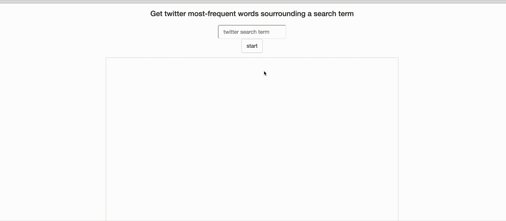

# twitter-live-stream-analysis-demo

This is a demo project orchestrating the following technologies:

* Apache Kafka
* Apache Spark ( spark-streaming)
* Websockets ( socket.io)
* Python / Flask
* d3.js 

The app lets you query the live stream of twitter statuses and find out which are the most common surrounding words around a search term. 

The twitter stream for a given search term is analyzed returning the top 10 most frequent words. 

The results are taken from a moving window of 30 seconds, being updated every 2 seconds.

Darker and bigger blobs  =>  more relevant terms.

##  Architecture

**kafka**: kafka message queue that receives twitter stream

**server/webapp**: flask webapp that serves html and provides a websocket socket.io to stream results from *processor* to *webapp*. 

**server/producer**: separate thread that get statuses from twitter api according to search term and writes them to a *kafka* topic.

**processor**:  consumes twitter statuses from **kafka** topic and makes the word count aggregation to calculate most frequent terms. Then emits results to *server/webapp* web socket.

## Getting started
* create an app in `dev.twitter.com` and input credentials and secret in `docker-compose.yml` under server.
* Just `docker-compose up` and then go to `http://localhost:5000`

## Purpose

This is just a toy project to start exploring some of the streaming apis available out there and see how they play out with the other components.

## Next steps

* try out kafka streaming analysis instead of spark-streaming
* use (key,value) messages within the topic to handle simultaneous search terms
* try out multiple kafka broker instances
* make better data-viz and show more info